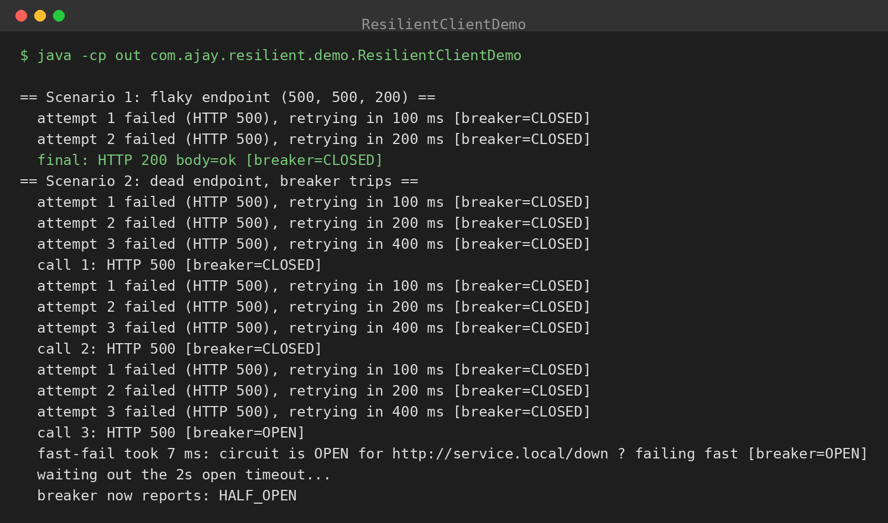

# resilient-http-client

A `java.net.http.HttpClient` wrapper with production resilience defaults:
exponential backoff + jitter retries, circuit breaker, and timeouts. Zero dependencies.

## The problem

Calling a downstream service with a bare HTTP client means one slow dependency can
take you down with it: threads pile up waiting, retries hammer a server that's already
struggling, and a 500 you should have ridden out becomes your outage.

## What's here

- **`ResilientHttpClient`** — one instance per downstream service. Applies, in order:
  breaker check → per-request timeout → retry loop. Network I/O goes through the
  **`Transport`** interface: `HttpClientTransport` for production, scripted fakes
  for tests and demos (resilience logic shouldn't need a socket to be verified).
- **`RetryPolicy`** — exponential backoff with full jitter. Retries I/O failures,
  timeouts, HTTP 429 and 5xx (except 501). Never retries 4xx — the request is wrong,
  trying again won't fix it.
- **`CircuitBreaker`** — CLOSED → OPEN → HALF_OPEN. Trips after N consecutive failures,
  fails fast while open (no thread pile-up), lets one probe through after the timeout.
- **`CircuitOpenException`** — thrown without touching the network when the breaker is open.

## Design decisions

- **Full jitter on backoff** (uniform in `[0, computed]`). Without it, all clients retry
  in lockstep and the recovering server eats a synchronized wave — the thundering herd.
  (Disabled in the demo for deterministic output; on in production.)
- **Breaker counts consecutive failures**, reset by any success. Simple, predictable,
  and right for client-side protection. Windowed failure ratios are the next step up.
- **Only the terminal outcome touches the breaker.** Retried attempts are expected
  noise; the breaker reacts to the call's final result.
- **Per-service client instances**, so each downstream gets its own breaker — a sick
  payments API must not trip the breaker for your healthy search API.
- **Failures during HALF_OPEN re-trip immediately.** One bad probe means the downstream
  isn't back yet.

## Project structure

```
src/com/ajay/resilient/
  ResilientHttpClient.java  RetryPolicy.java  Transport.java  HttpClientTransport.java
  CircuitBreaker.java       CircuitOpenException.java
  demo/ResilientClientDemo.java  demo/ScriptedTransport.java  demo/SimpleHttpResponse.java
```

## Build & run (Java 17+, no dependencies)

```bash
cd resilient-http-client
javac -encoding UTF-8 -d out $(find src -name '*.java')
java -cp out com.ajay.resilient.demo.ResilientClientDemo
```

(The demo uses a scripted in-process transport — no sockets — so it runs anywhere.
Production code uses `HttpClientTransport`, the real `java.net.http` client.)

## Example output

```
== Scenario 1: flaky endpoint (500, 500, 200) ==
  attempt 1 failed (HTTP 500), retrying in 100 ms [breaker=CLOSED]
  attempt 2 failed (HTTP 500), retrying in 200 ms [breaker=CLOSED]
  final: HTTP 200 body=ok [breaker=CLOSED]
== Scenario 2: dead endpoint, breaker trips ==
  attempt 1 failed (HTTP 500), retrying in 100 ms [breaker=CLOSED]
  attempt 2 failed (HTTP 500), retrying in 200 ms [breaker=CLOSED]
  attempt 3 failed (HTTP 500), retrying in 400 ms [breaker=CLOSED]
  call 1: HTTP 500 [breaker=CLOSED]
  attempt 1 failed (HTTP 500), retrying in 100 ms [breaker=CLOSED]
  attempt 2 failed (HTTP 500), retrying in 200 ms [breaker=CLOSED]
  attempt 3 failed (HTTP 500), retrying in 400 ms [breaker=CLOSED]
  call 2: HTTP 500 [breaker=CLOSED]
  attempt 1 failed (HTTP 500), retrying in 100 ms [breaker=CLOSED]
  attempt 2 failed (HTTP 500), retrying in 200 ms [breaker=CLOSED]
  attempt 3 failed (HTTP 500), retrying in 400 ms [breaker=CLOSED]
  call 3: HTTP 500 [breaker=OPEN]
  fast-fail took 7 ms: circuit is OPEN for http://service.local/down — failing fast [breaker=OPEN]
  waiting out the 2s open timeout...
  breaker now reports: HALF_OPEN
```

## Results



The screenshot is the real demo output. Scenario 1 shows the retry policy absorbing
two 500s with exponential backoff (100ms, 200ms) and landing the 200. Scenario 2
shows the breaker tripping OPEN after three terminal failures, the next call
failing fast in 7ms without touching the network, and the breaker reporting
HALF_OPEN once the 2s timeout elapses — the probe that decides whether the
downstream has recovered.

Tune via the builders: `RetryPolicy.builder().maxAttempts(5)...`, and
`new CircuitBreaker(failureThreshold, openTimeout)`.
